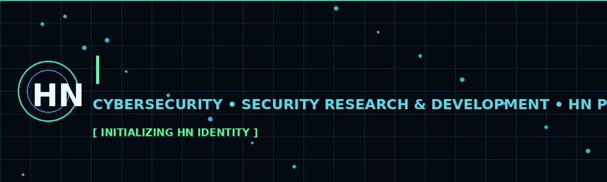
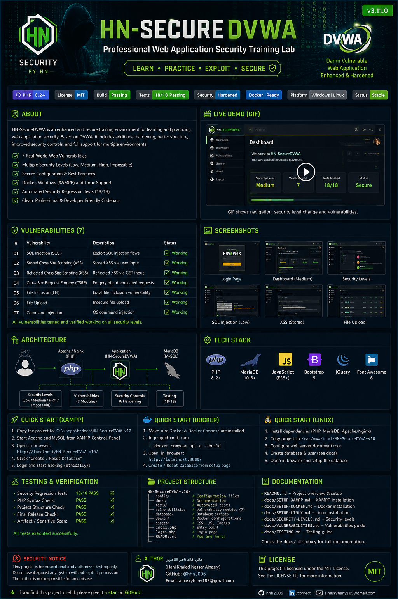

<div align="center">



</div>
<div align="center">

# 🛡️ HN-SecureDVWA

### Professional Web Application Security Training Lab

<a href="https://github.com/hhh2006">
  
</a>

<p>
  
  
  
  
</p>

<p>
  
  
  
  
  
</p>

<p>
  <strong>⚠️ Educational and authorized-security-testing project only.</strong>
</p>

</div>

---

## 🎬 Project Showcase

> **The visuals below are presentation assets.** The application functionality remains in the project source and should be validated by running the lab locally.

<div align="center">
  
</div>

<div align="center">

**LEARN → PRACTICE → ANALYZE → HARDEN → VERIFY**

</div>

---

## 🧭 What is HN-SecureDVWA?

**HN-SecureDVWA** is an enhanced web-application security training environment based on the Damn Vulnerable Web Application (DVWA) concept.

The goal is not simply to provide vulnerable pages. The project adds a structured security layer around the training experience, including security levels, defensive controls, security-event monitoring, documentation, regression checks, and release-oriented verification.

It is designed for students, security learners, developers, and authorized testers who want a controlled environment for understanding how common web vulnerabilities behave and how defensive controls change the outcome.

### Core objectives

- 🔎 Understand common web-application vulnerabilities.
- 🧪 Practice exploitation inside a controlled local laboratory.
- 🛡️ Compare vulnerable behavior with hardened behavior.
- 📊 Observe security events and outcomes through the security layer.
- 🧰 Learn how input validation, output encoding, parameterized queries, and safer file handling reduce attack surface.
- ✅ Run repeatable regression checks before releases.
- 📚 Keep the project documented instead of relying on undocumented behavior.

---

## 🔥 Why this project is different

HN-SecureDVWA is intentionally more than a collection of vulnerable pages.

| Area | Included |
|---|---|
| Vulnerability training | ✅ |
| Multiple security levels | ✅ |
| Defensive controls | ✅ |
| Security-event monitoring | ✅ |
| Regression test suite | ✅ |
| Project-structure validation | ✅ |
| Release validation | ✅ |
| XAMPP / Windows workflow | ✅ |
| Docker workflow | ✅ Source configuration included |
| Linux-oriented documentation | ✅ |
| Fake production claims | ❌ |
| Real-world target scanning | ❌ |
| Unauthorized attack functionality | ❌ |

The project is deliberately positioned as a **local security laboratory**, not as a production security platform.

---

# 🧨 Vulnerability Lab

The training environment covers seven core web-application vulnerability areas:

| # | Vulnerability | Main learning focus |
|---:|---|---|
| 01 | **SQL Injection (SQLi)** | Injection, query construction, prepared statements |
| 02 | **Blind SQL Injection** | Boolean/time-based concepts and defensive validation |
| 03 | **Command Injection** | OS command boundaries, validation and argument escaping |
| 04 | **Reflected XSS** | Input reflection, detection and output encoding |
| 05 | **DOM XSS** | Client-side data flow and safer rendering |
| 06 | **Stored XSS** | Persistent input, safe storage and output encoding |
| 07 | **File Upload** | Extension/MIME/size/image validation and safer storage |

> **Important:** These modules are intentionally educational. Test only against your own local instance or another environment where you have explicit authorization.

---

# 🛡️ Security Controls

The project preserves the training purpose while documenting defensive improvements applied to the relevant modules.

### SQL Injection

- Parameterized/prepared SQL statements.
- Input validation where appropriate.
- Reduced reliance on direct string concatenation for database queries.

### Command Injection

- IPv4 input validation in the relevant workflow.
- Shell argument escaping.
- Narrower accepted input format.

### Reflected / Stored XSS

- Detection of suspicious input patterns where implemented.
- HTML output encoding.
- Parameterized database writes for the hardened stored-XSS path.

### DOM XSS

- Safer rendering approach in the checked module.
- Avoidance of raw unsafe document-writing patterns in the hardened path.

### File Upload

- Extension validation.
- MIME validation.
- File-size limits.
- Image validation/re-encoding where applicable.
- Randomized file naming to reduce predictable storage paths.

---

# 🎚️ Security Levels

The project retains the training concept of changing security behavior through multiple levels.

```text
LOW
 │
 ├── Minimal defensive restrictions
 │
 ▼
MEDIUM
 │
 ├── Additional validation / filtering
 │
 ▼
HIGH
 │
 ├── Stronger defensive controls
 │
 ▼
IMPOSSIBLE
     └── Hardened implementation intended to demonstrate safer patterns
```

The exact behavior should always be verified against the current implementation and the accompanying documentation rather than inferred from the level name alone.

---

# 📊 Security Monitoring

The custom HN security layer provides a security-oriented view around application activity.

It includes functionality/documentation around:

- Security events.
- Blocked vs. successful outcomes.
- Attack distribution.
- Recent-event visibility.
- Searchable security logs.
- Security scoring/summary views.
- Investigation/reporting views.
- Database-backed `security_events` data.

This monitoring layer is intended for **local training and analysis**. It should not be represented as a full enterprise SIEM, EDR, WAF, or SOC platform.

---

# 🧪 Verification Status

The release package was checked before publication preparation.

| Verification | Result |
|---|---:|
| PHP syntax lint | ✅ PASS — 187 PHP files checked |
| Project structure check | ✅ PASS |
| Security regression suite | ✅ **18/18 PASS** |
| Final release check | ✅ PASS |
| Release artifact scan | ✅ PASS |
| Environment-driven config template | ✅ PASS |
| Docker source-build static review | ✅ PASS |
| Docker runtime in audit environment | ⚪ Not executed |
| Windows/XAMPP browser runtime in audit environment | ⚪ Not executed |

### What this means

The source package and automated checks pass. Runtime behavior still needs to be validated on the target Windows/XAMPP or Docker environment before describing a deployment as fully runtime-verified.

That distinction is intentional: **no untested runtime result is presented as a fact.**

---

# 🚀 Quick Start — Windows + XAMPP

### 1. Extract the project

Place the project under:

```text
C:\xampp\htdocs\HN-SecureDVWA-v10\
```

### 2. Start services

Open the XAMPP Control Panel and start:

```text
Apache
MySQL
```

### 3. Open the application

```text
http://localhost/HN-SecureDVWA-v10/
```

### 4. Initialize the database

Use the application's database/setup workflow and create/reset the DVWA database as required by the local environment.

### 5. Log in

Use the credentials configured for your local lab instance.

### 6. Verify the application

Check:

- Login/logout.
- Dashboard.
- Navigation.
- CSS/JS assets.
- Security-level switching.
- All seven vulnerability modules.
- Security-event logging.
- Database persistence.

---

# 🐳 Quick Start — Docker

The repository contains a local Docker Compose configuration and a source-built application image.

From the project directory:

```bash
docker compose up -d --build
```

Then inspect the services:

```bash
docker compose ps
```

View application logs when troubleshooting:

```bash
docker compose logs -f dvwa
```

The supplied Compose configuration is intended for local development/training use. Do not expose the deliberately vulnerable laboratory to an untrusted network.

---

# 🐧 Linux

The source is PHP-based and can be hosted with a compatible PHP web server and MariaDB/MySQL environment.

Recommended workflow:

1. Install PHP and required extensions.
2. Install MariaDB/MySQL.
3. Configure the database using the environment-driven configuration template.
4. Configure Apache or Nginx.
5. Point the document root at the project.
6. Initialize the database.
7. Open the application locally.
8. Run the supplied verification tests.

See the documentation under `docs/` for the project-specific setup guidance.

---

# 🗂️ Project Structure

```text
HN-SecureDVWA-v10/
│
├── config/                 # Configuration and environment templates
├── database/               # Database-related project resources
├── docs/                   # Security, setup, release and testing documentation
├── hackable/               # DVWA training resources
├── security/               # HN security layer
├── tests/                  # Automated project and security checks
├── vulnerabilities/        # Vulnerability training modules
├── assets/                 # README/project presentation assets
├── Dockerfile              # Container build definition
├── compose.yml              # Local Docker Compose configuration
├── README.md               # Project documentation
├── SECURITY.md             # Security policy / responsible-use information
└── VERSION                 # Current project version
```

---

# 📚 Documentation

The `docs/` directory contains the project's detailed documentation, including:

- Security controls.
- Threat model.
- Security test matrix.
- Demo/runbook material.
- Setup guidance.
- Release documentation.
- UI and compliance-oriented reports.
- DVWA reference documentation.

Start with:

```text
docs/
```

and then open the document most relevant to the task you are performing.

---

# 🔐 Responsible Use

HN-SecureDVWA contains intentionally vulnerable functionality because it is a security-training laboratory.

**Use it only:**

- On your own computer.
- In an isolated lab.
- Against systems you own.
- Against systems for which you have explicit authorization to test.

**Do not:**

- Deploy the vulnerable lab to the public Internet.
- Use it against third-party systems without authorization.
- Treat the intentionally vulnerable modules as production-ready code.
- Present the training environment as a real-world security control system.

---

# 🧰 Technology Stack

<div align="center">

| Technology | Role |
|---|---|
| PHP | Application runtime |
| MySQL / MariaDB | Database |
| HTML / CSS | UI |
| JavaScript | Client-side interactions |
| Bootstrap / jQuery where used | UI and frontend support |
| Apache / XAMPP | Windows local hosting workflow |
| Docker / Compose | Reproducible local container workflow |

</div>

---

# 🧱 Design Principles

### 01 — Local-first

The project is designed to run locally rather than depending on paid cloud infrastructure.

### 02 — Evidence over claims

Tests and runtime validation should determine what is considered verified.

### 03 — Vulnerable by design, hardened by comparison

The laboratory keeps intentionally vulnerable scenarios so learners can understand the attack surface, while the security layer demonstrates safer implementation patterns.

### 04 — Documentation is part of the project

Security controls, testing, release notes and limitations are documented instead of hidden behind marketing language.

### 05 — No fake telemetry

The project should not manufacture security events, scan results, or deployment claims and present them as real-world observations.

---

# 🏁 Release Information

**Current release:** `v3.11.0`

The release package includes configuration templates, project documentation, automated checks, Docker source configuration, and cleanup of temporary backup/runtime artifacts.

For release evidence and detailed validation boundaries, see:

```text
RELEASE-AUDIT.md
```

---

# 🤝 Contributing

Contributions are welcome when they improve the educational value, security clarity, maintainability, documentation, or test coverage of the project.

Before submitting a change:

1. Understand the affected vulnerability/security module.
2. Preserve the laboratory purpose.
3. Avoid adding unverified security claims.
4. Update documentation when behavior changes.
5. Run the relevant tests.
6. Keep changes focused and reviewable.

See:

```text
CONTRIBUTING.md
```

---

# ⭐ Support the Project

If you find HN-SecureDVWA useful for learning web application security, consider giving the repository a ⭐ on GitHub.

<div align="center">

**Security is not just about breaking things — it is about understanding why they break and how to build them better.**

</div>

---

# 👤 Author

<div align="center">

### Hani Khaled Nasser Alnasry

Cybersecurity Student • Security Research & Development • HN Projects

[](https://github.com/hhh2006)

</div>

---

# 📜 License & Attribution

This project is distributed under the **MIT License** as documented in the repository.

HN-SecureDVWA is based on the DVWA training concept and retains attribution/license materials required by the underlying project. See `COPYING.txt` and the project documentation for the applicable licensing and attribution information.

---

<div align="center">

**HN-SecureDVWA — Web Application Security Training Lab**

`v3.11.0` • `18/18 Automated Checks Passing` • `Educational / Authorized Testing`

</div>
